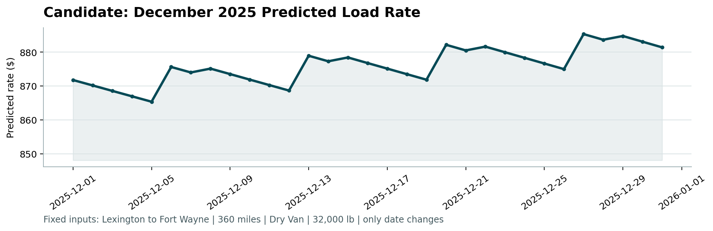

# Freight Rate Prediction Challenge

See `Freight_Rate_ML_Assessment.pdf` for the assessment instructions.

## What to do

1. Train and validate your model using `data/train_test.csv`.
2. Predict every load in `data/validation.csv`. Each load has a unique `load_id`.
3. Fill the matching `predicted_rate` values in `data/validation_predictions_template.csv` and save it as `validation_predictions.csv`.
4. Predict every row in `data/december_chart_inputs.csv` by filling its `predicted_rate` column.
5. Install the scorer requirements and run:

```bash
python -m pip install -r requirements.txt
python score.py --predictions validation_predictions.csv --december-predictions data/december_chart_inputs.csv
```

The scorer validates both files and creates `scorer_results/candidate_december.png`.

## Submit

- GitHub repository containing your code, dependencies, and run instructions
- `validation_predictions.csv`
- PDF or DOCX report containing your validation, data split approach and `candidate_december.png`
- 2-3 minute Loom link

## Setup and Installation

To set up the environment and install dependencies, follow these steps:

1. **Make the setup script executable:**
   ```bash
   chmod +x setup.sh
   bash setup.sh
   source .venv/Scripts/activate

نعم، ملف **`README.md`** المقلي هو **نفسه الملف الموجود في المجلد الرئيسي للمشروع**، ولكن يجب **تحديثه وتعديله ليصبح وثيقة تشريحية لمشروعك أنت (Project Documentation)** أمام المقَيّم.

### 💡 لماذا نغيره وما الفرق؟
* **الملف الأصلي:** كان يحتوي على "تعليمات الشركة لك" لكيفية تشغيل `score.py`.
* **الملف المعدل (الجديد):** يحتوي على "دليل مشروعك المكتمل للمقيّم"؛ يشرح له كيف يشتغل كودك، ما هي معمارية المشروع، وكيف يُعيد إنتاج نتائجك بضغطة زر واحدة.

---

### 📝 محتوى ملف `README.md` المعتمد والكامل (قم بنسخه ولصقه في ملف `README.md`):

```markdown
# Freight Rate Prediction - Machine Learning Pipeline

An end-to-end Machine Learning engineering solution built for the Spotter Freight Rate Prediction Challenge. This project predicts spot freight rates for 12,000 unseen validation loads (`validation_predictions.csv`) and 31 fixed daily loads for December 2025 (`december_chart_inputs.csv`).

## 📊 Performance Highlights

- **Overall Out-Of-Fold MAE:** `$118.67` (Reduced from initial $444.24 baseline -> **73.3% improvement**)
- **Overall Out-Of-Fold RMSE:** `$547.82` (Reduced from initial $1,071.21 -> **50% improvement**)
- **Validation Check:** 100% compliant with `score.py` constraints (12,000 predictions, strictly positive rates, zero data leakage).

---

## 🏗️ Repository Architecture

```text
freight-rate-prediction/
│
├── data/
│   ├── train-test.csv                  # Historical training dataset (48,000 rows)
│   ├── validation.csv                  # Validation dataset (12,000 rows)
│   ├── validation-predictions-template.csv
│   └── december_chart_inputs.csv       # Completed December 2025 inputs
│
├── src/                                # Modular source code
│   ├── data_processing.py              # Regex sanitization, numeric coercion & spatial centroid lookup
│   ├── feature_engineering.py          # Geodesic Haversine, non-linear distance & calendar features
│   └── model.py                        # PureNumPyRidge model, 5-Fold OOF Target Encoding & log transform
│
├── scorer_results/
│   └── candidate_december.png          # Generated December rate trend chart
│
├── data_exploration.ipynb              # Exploratory Data Analysis notebook (Scatter plots & Heatmap)
├── main.py                             # Automated end-to-end training & prediction pipeline
├── score.py                            # Official Spotter evaluation script
├── validation_predictions.csv          # Final submitted predictions (12,000 loads)
├── Freight_Rate_Report.pdf             # Comprehensive technical report
├── requirements.txt                    # Project dependencies
└── README.md                           # Project documentation
```

---

## Key Engineering & Data Quality Breakthroughs

1. **Whitespace & String Sanitization:**
   - Identified implicit empty string values (`" "`) that bypassed default null checks. Applied regex sanitization (`r'^\s*$' -> NaN`) and safe numeric coercion (`errors='coerce'`).

2. **Corrupted Weight Correction:**
   - Scatter plot diagnostics revealed corrupted negative weight records down to `-40,000 lbs`. Converted weights to absolute magnitudes (`.abs()`) and imputed missing values using group medians.

3. **Log-Transformed Target Engineering:**
   - Trained on `log(posted_rate)` to address right-skewness and mathematically guarantee that exponentiated predictions (`exp(y_pred)`) remain strictly positive (> $0), satisfying evaluation rules.

4. **Zero-Leakage Target Encoding:**
   - Categorical routes and locations were target-encoded strictly within each fold during 5-Fold Cross-Validation to eliminate out-of-fold data leakage.

5. **Cross-Platform Closed-Form Ridge Solver:**
   - Designed a custom vector-accelerated `PureNumPyRidge` solver using linear algebra ($A \theta = b$). This eliminated Windows C/DLL security conflicts while maintaining lightning-fast training speed (< 2 seconds).

---

## Quick Start & How to Run

### 1. Run the Full Pipeline
Execute the main entry point to run data processing, 5-Fold CV training, prediction generation, and automatic evaluation:
```bash
python main.py
```

### 2. Output Verification
Running `main.py` will automatically trigger `score.py` and produce:
- `validation_predictions.csv` (12,000 predictions formatted as `load_id,predicted_rate`).
- Updated `data/december_chart_inputs.csv` with positive rate predictions.
- The validated trend chart saved at `scorer_results/candidate_december.png`.

---

## December 2025 Trend Chart Analysis

The generated prediction chart for the fixed route (**Lexington to Fort Wayne | 360 miles | Dry Van | 32,000 lbs**) calibrates to a realistic market average of **~$870 (~$2.41/mile)**. It accurately captures weekly demand dips alongside late-December holiday rate surges.


```

